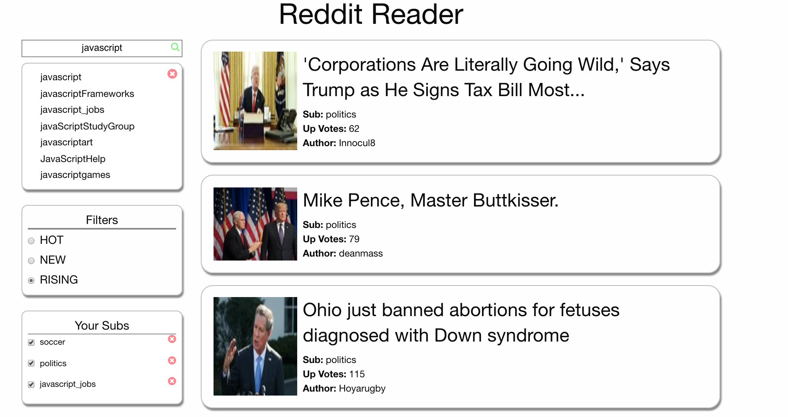
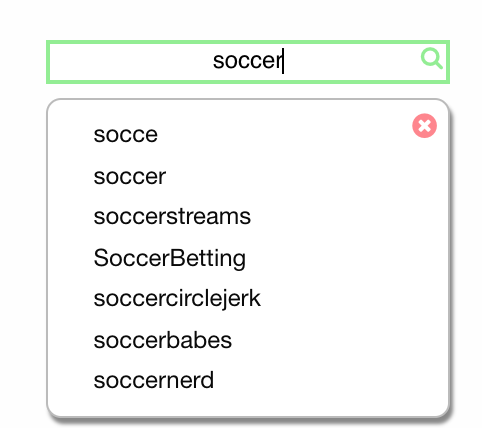

# Reddit Reader

### To Run

1. clone this repository
2. navigate to this directory in terminal
3. `npm run setup`
4. in browser, navigate to localhost:5050

## Summary

This application was constructed noting the user should store all relevant query information in the state.  Then, whenever the user changes the application state, the listener fires a query.  For each sub-reddit the user subscribes to, the results are merged together in the new state.

## Features

### User-preference subreddit feed
Reddit can be difficult to navigate. The feed available here is set to the user preferences. User can add and delete subreddits by using the table on the left-hand side.

### Autocomplete Search
User can browse all of reddit for subreddits that are congruent with their interests.

## Design

This application was constructed using **React.js** framework, utilizing the Redux cycle for state management.  **Foundation** was implemented for app responsiveness.

## Future Improvements

* Whenever the user refreshes the page, the application loses its current data. In order for this data to persist, the application would require a backend.

* The limit for requests on listings has been set to 10.  Ideally, the user could specify this limit for himself/herself.  The limit is set so as to not bottleneck the payload.

* Private subreddits are unavailable in this application.  Providing authentication may make this doable in the future.
